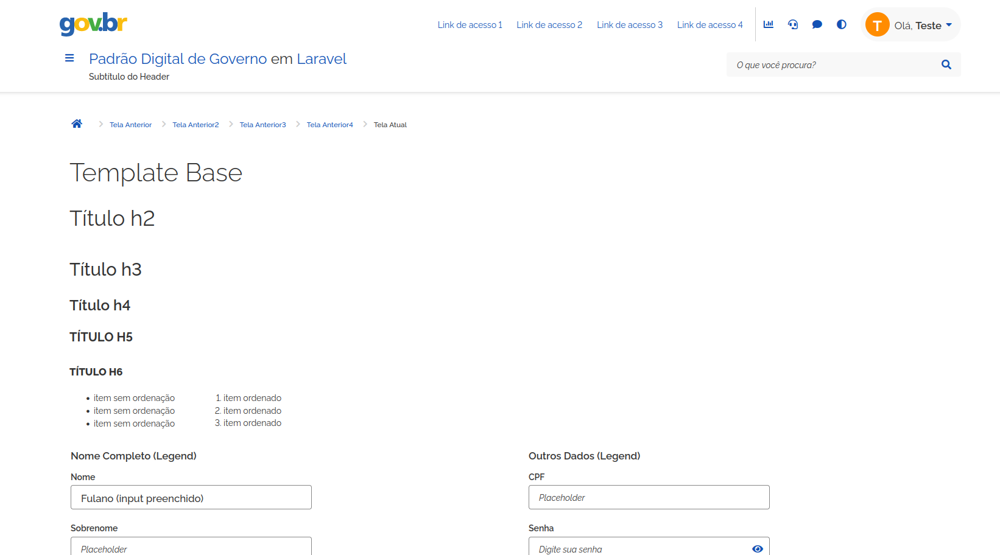

# Padrão Digital de Governo em Laravel

Template CSS do [Padrão Digital de Governo](https://www.gov.br/ds/ 'Acesse a página do Padrão Digital de Governo') 
adaptado para utilização no [Laravel](https://laravel.com/). A partir desse projeto é possível desenvolver uma aplicação 
PHP com a interface oficial do governo sem nenhuma configuração adicional de CSS. As classes utilizadas devem ser as 
mesmas presentes na [documentação oficial](https://www.gov.br/ds/home).  

O [Padrão Digital de Governo](https://www.gov.br/ds/ 'Acesse a página do Padrão Digital de Governo') apresenta os 
padrões de interface que devem ser seguidos por designers e desenvolvedores para garantir a experiência única na 
interação dos usuários com os sistemas interativos do Governo Brasileiro. 

## Estrutura de código


- O ambiente BASE foi configurado com [LARAVEL SAIL](https://laravel.com/docs/11.x/sail) + [LARAVEL BREEZE](https://laravel.com/docs/11.x/starter-kits#laravel-breeze).
- O CSS utilizado é o do padrão oficial do governo. Para mais detalhes, acesse a [documentação oficial](https://www.gov.br/ds/home).
- De forma complementar, foi instalado o [laravel-pt-BR-localization](https://github.com/lucascudo/laravel-pt-BR-localization), que implementa a tradução do Laravel para PT-BR.

## Capturas de tela

### Login (Laravel Breeze)
<kbd></kbd>

---

### Registro de usuário (Laravel Breeze)
<kbd></kbd>
---

### Painel inicial
<kbd></kbd>

---

### Template base
<kbd></kbd>

---

### Menu lateral
<kbd></kbd>

---

### Perfil de usuário (Laravel Breeze)
<kbd></kbd>

---

## Instalação e primeiro acesso

### Comandos essenciais para rodar

##### 1 - Cria um alias para execurar o [Laravel Sail](https://laravel.com/docs/sail) de forma facilitada:
```bash
alias sail='sh $([ -f sail ] && echo sail || echo vendor/bin/sail)'
```

##### 2 - Instala dependências para execurar o [Laravel Sail](https://laravel.com/docs/sail):
```bash
docker run --rm \
    -u "$(id -u):$(id -g)" \
    -v "$(pwd):/var/www/html" \
    -w /var/www/html \
    laravelsail/php82-composer:latest \
    composer install --ignore-platform-reqs
```

##### 3 - Instala dependências NPM:
```bash
npm install
```

##### 4 - Cria o arquivo '.env' a partir do arquivo exemplo:
```bash
cp .env.example .env
```
##### 5 - Após criar o arquivo '.env', é necessário configurar as variáveis `FORWARD_DB_PORT`, `DB_CONNECTION`, `DB_HOST`, `DB_PORT`, `DB_DATABASE`,`DB_USERNAME`, `DB_PASSWORD`. Sem essa configuração, o sistema não consegue se comunicar com o banco de dados.

Exemplo de configuração:
```php
  FORWARD_DB_PORT=6543
  DB_CONNECTION=pgsql
  DB_HOST=pgsql
  DB_PORT=5432
  DB_DATABASE=teste
  DB_USERNAME=teste
  DB_PASSWORD=123456
```
##### 6 - Ainda no arquivo '.env', é necessário criar a variável `APP_PORT` e atribuir a ela o número da porta desejada para acesso do sistema no navegador.

##### 6.1 - Exemplo de configuração:
```php
  APP_PORT=123
  APP_URL=http://localhost:${APP_PORT}
```

No exemplo de configuração acima, o sistema estará disponível na seguinte URL:
```php
  http://localhost:123
```
##### 7 - Configura a `APP_KEY` do sistema. Por que isso é necessário? Mais detalhes [aqui](https://laravel.com/docs/encryption).

```bash
php artisan key:generate
```

##### 8 - Roda os serviços via [Laravel Sail](https://laravel.com/docs/sail), em modo "detached":
```bash
sail up -d
```
##### 9 - Roda todas as migrations do sistema para o Laravel Breeze funcionar. Por que isso é necessário? Mais detalhes [aqui](https://laravel.com/docs/migrations).
```bash
sail artisan migrate
```

##### 10 - Compila o CSS:
```bash
sail npm run build
```

##### 11 - Primeiro acesso

No primeiro acesso é necessário cadastrar um usuário. Caso tenha configurado a variável a `APP_PORT` [conforme o exemplo indicado](#61---exemplo-de-configuração), é possível fazer o procedimento pelo link:

```php
  http://localhost:123/register
```
